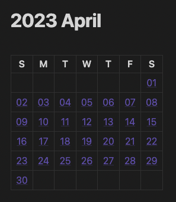
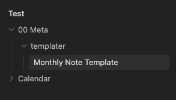

I've been using Obsidian to manage my notes. It's an editor that allows you to write all your notes in Markdown format. I've been using two plugins (Templater and Periodic Notes) as part of my daily workflow to log daily notes, events, and tasks. I also write a monthly note to track and summarize things that happened and what I accomplished throughout the month. I wanted a nice way to easily link back to any of the daily notes for a given month, so I crafted a script to generate a markdown table which embeds wikilinks for each day of the month. The information I've included below should help you to set up a calendar for yourself.



## Setting Up Obsidian

For this tutorial you'll need:

- Obsidian
- The Templater plugin
- The Periodic Notes plugin

If you're new to Obsidian, here's a quick overview of how to install and configure both plugins:

1. In [Obsidian](https://obsidian.md/), open the Settings/Preferences menu.
2. Select the Community Plugins in the sidebar.
3. Click on the **Turn on community plugins** button.
4. Click on the **Browse** button
5. Search for [Templater](https://github.com/SilentVoid13/Templater)
6. Click **Install**
7. Click **Enable**
8. Click **Options**
9. Set a **template folder location**. I have mine set to `00 Meta/templater`
10. Enable **Trigger Templater on new file creation**, this will allow you to use Templater templates with other plugins that generate files
11. Return to the community plugins search
12. Search for, install, and enable [Periodic Notes](https://github.com/liamcain/obsidian-periodic-notes). Then navigate to its options panel.
13. Enable the **Monthly Notes** (You'll also want to create daily notes, but that's out of scope for this article).
14. Enter `YYYY/MM MMMM/YYYY-MM` in the **Format** input field
15. Enter `00 Meta/templater/Monthly Note Template.md` in the **Monthly Note Template** field
16. Enter `Calendar/` for the **Note Folder**

## The Script

Here's the an annotated version of the script we're going to use in our template to generate an embedded Markdown Calendar. Each day of the calendar grid will also include a wikilink to that day's daily note. Those wikilinks will point to a path such as: `Calendar/2023/04 April/2023-04-17 Monday`.

```javascript
// stores the base folder path where your periodic notes live
let baseFolder = 'Calendar';

// Templater provides access to moment.js
// here we use the file title to generate a date
var today = moment(tp.file.title, 'YYYY-MM');

// this method takes a date and generates a wikilink path
// that points to the daily note for that date
function pathForDailyNote(date) {
  let year = date.format('YYYY');
  let month = date.format('MM MMMM');
  let filename = date.format('YYYY-MM-DD dddd');
  return `${baseFolder}/${year}/${month}/${filename}`;
}

// get the numerical value for the curent month
const calendarMonth = today.month();

// calculate the start of the week that contains the first day
const calendarStart = today.clone().startOf('month').startOf('week');

// calculate the end of the week that contains the last day
const calendarEnd = today.clone().endOf('month').endOf('week');

// create a date counter
// In the while loop below we're adding 1 day to the counter
// each time we go through the loop. This operation happens before
// the value is set, so we start the counter 1 day prior.
let date = calendarStart.clone().subtract(1, 'day');

// generate a multi-dimensional array to represent a matrix
// each row represents a week on the calendar (7 days)
// each column is a day of the week
const calendar = [];
while (date.isBefore(calendarEnd, 'day')) {
  calendar.push(Array(7).fill(0).map(() => date.add(1, 'day').clone()));
}

// this array contains each line of the markdown calendar
// prefill it with headers for the days of the week
let calenderLines = [
  `|S|M|T|W|T|F|S|`,
  `|:-:|:-:|:-:|:-:|:-:|:-:|:-:|`,
];

// Iterate through each row of the multi-dimensional array from earlier
calendar.forEach((row) => {
  // Use an array map to generate a list of wikilinks
  // each link points to a daily notes
  // If the day falls outside of the calendar month,
  // then leave the cell blank.
  let week = row.map((day) => (
    (day.month() == calendarMonth) ? `[[${pathForDailyNote(day)}\\|${day.format("DD")}]]` : ` `
  ));
  // join the days of the week together with `|`
  // this forms a row in the markdown table
  calenderLines.push(`|${week.join('|')}|`);
});

// Temlater uses a variable named "tR" to contain the processed output
// from any JS execution command. So we append our calendar lines to that.
tR += calenderLines.join('\n');
```

## The Monthly Note Template

To create your own **Monthly Note Template** file, copy the template below:

```text
---
<%*
let baseFolder = 'Calendar';
var today = moment(tp.file.title, 'YYYY-MM');

function pathForDailyNote(date) {
  let year = date.format('YYYY');
  let month = date.format('MM MMMM');
  let filename = date.format('YYYY-MM-DD dddd');
  return `${baseFolder}/${year}/${month}/${filename}`;
}
-%>
type: monthly-note
classification: private
created: <% tp.file.creation_date("YYYY-MM-DDTHH:mm:ssZ") %>
updated: <% tp.date.now("YYYY-MM-DDTHH:mm:ssZ") %>
tags:
 - calendar/monthly
---

# <% today.format("YYYY MMMM") %>

<%*
const calendarMonth = today.month();
const calendarStart = today.clone().startOf('month').startOf('week');
const calendarEnd = today.clone().endOf('month').endOf('week');

let date = calendarStart.clone().subtract(1, 'day');
const calendar = [];
while (date.isBefore(calendarEnd, 'day')) {
  calendar.push(Array(7).fill(0).map(() => date.add(1, 'day').clone()));
}

let calenderLines = [
  `|S|M|T|W|T|F|S|`,
  `|:-:|:-:|:-:|:-:|:-:|:-:|:-:|`,
];
calendar.forEach((row) => {
  let week = row.map((day) => (
    (day.month() == calendarMonth) ? `[[${pathForDailyNote(day)}\\|${day.format("DD")}]]` : ` `
  ));
  calenderLines.push(`|${week.join('|')}|`);
});

tR += calenderLines.join('\n');
%>

## Notes


## Month In Review

```

If you used the template folder location from the setup instructions earlier, you'll want to put your template file in the `00 Meta/templater/` folder.



## The Generated Markdown

When you generate your monthly note (using the Periodic Notes plugin), it should now generate a note with a markdown table similar to the one below:

```markdown
|S|M|T|W|T|F|S|
|:-:|:-:|:-:|:-:|:-:|:-:|:-:|
| | | | | | |[[Calendar/2023/04 April/2023-04-01 Saturday\|01]]|
|[[Calendar/2023/04 April/2023-04-02 Sunday\|02]]|[[Calendar/2023/04 April/2023-04-03 Monday\|03]]|[[Calendar/2023/04 April/2023-04-04 Tuesday\|04]]|[[Calendar/2023/04 April/2023-04-05 Wednesday\|05]]|[[Calendar/2023/04 April/2023-04-06 Thursday\|06]]|[[Calendar/2023/04 April/2023-04-07 Friday\|07]]|[[Calendar/2023/04 April/2023-04-08 Saturday\|08]]|
|[[Calendar/2023/04 April/2023-04-09 Sunday\|09]]|[[Calendar/2023/04 April/2023-04-10 Monday\|10]]|[[Calendar/2023/04 April/2023-04-11 Tuesday\|11]]|[[Calendar/2023/04 April/2023-04-12 Wednesday\|12]]|[[Calendar/2023/04 April/2023-04-13 Thursday\|13]]|[[Calendar/2023/04 April/2023-04-14 Friday\|14]]|[[Calendar/2023/04 April/2023-04-15 Saturday\|15]]|
|[[Calendar/2023/04 April/2023-04-16 Sunday\|16]]|[[Calendar/2023/04 April/2023-04-17 Monday\|17]]|[[Calendar/2023/04 April/2023-04-18 Tuesday\|18]]|[[Calendar/2023/04 April/2023-04-19 Wednesday\|19]]|[[Calendar/2023/04 April/2023-04-20 Thursday\|20]]|[[Calendar/2023/04 April/2023-04-21 Friday\|21]]|[[Calendar/2023/04 April/2023-04-22 Saturday\|22]]|
|[[Calendar/2023/04 April/2023-04-23 Sunday\|23]]|[[Calendar/2023/04 April/2023-04-24 Monday\|24]]|[[Calendar/2023/04 April/2023-04-25 Tuesday\|25]]|[[Calendar/2023/04 April/2023-04-26 Wednesday\|26]]|[[Calendar/2023/04 April/2023-04-27 Thursday\|27]]|[[Calendar/2023/04 April/2023-04-28 Friday\|28]]|[[Calendar/2023/04 April/2023-04-29 Saturday\|29]]|
|[[Calendar/2023/04 April/2023-04-30 Sunday\|30]]| | | | | | |
```

Hope you enjoy!
